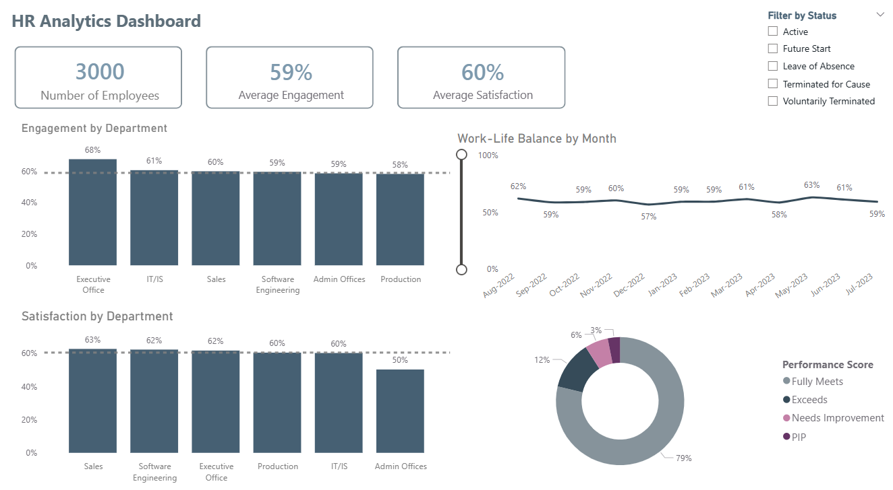

# Employee Analysis Dashboard

## Project Overview

This project analyzes employee engagement, satisfaction, work-life balance, termination, and performance data in an interactive Power BI dashboard.
The report uses the [Employee/HR Dataset (All in One)](https://www.kaggle.com/datasets/ravindrasinghrana/employeedataset) from Kaggle, a synthetic HR dataset created for employee management and analytics practice.
It combines employee profile data and employee engagement survey results with a custom calendar table created in Power BI for dynamic date-based analysis.

The objective was to:

- Monitor employee engagement, satisfaction, and work-life balance metrics

- Compare employee experience indicators across department types

- Track work-life balance and termination trends over time

- Analyze employee status and performance score distribution

- Provide an executive dashboard view for quick HR decision-making

## Tools & Technologies

- Power BI Desktop

- Power Query

- DAX

## Source Data & Data Model

The analysis is based on two source datasets:

- `employee_data` - employee profile, department, status, performance score, and termination-related fields

- `employee_engagement_survey_data` - employee survey metrics including engagement, satisfaction, and work-life balance

An additional `Calendar` table was created in Power BI to support customized date logic and dynamic monthly trend visuals.

The source dataset is synthetic and fictional, so the dashboard should be interpreted as an HR analytics portfolio project rather than a report on a real organization.

[View data model notes](docs/data_model.png)

## Data Preparation

The data cleaning and modeling process was performed directly in Power BI using Power Query and DAX. The preparation included:

- Loading employee profile and survey datasets into Power BI

- Standardizing fields used for department, employee status, and performance analysis

- Cleaning and shaping the source tables using Power Query

- Creating a custom calendar table for date-based visual analysis

- Building relationships between employee data, survey results, and the calendar table

- Creating calculated metrics for average engagement, satisfaction, work-life balance, and termination tracking

## Dashboard



The report includes:

- **KPI Overview** - number of employees, average engagement, and average satisfaction

- **Engagement by Department** - department-level comparison of average engagement

- **Satisfaction by Department** - department-level comparison of average satisfaction

- **Work-Life Balance by Month** - monthly trend of work-life balance score

- **Performance Score Distribution** - employee distribution by performance category

- **Employee Status Filter** - slicer for active, future start, leave of absence, and terminated employee groups

**Interactive filters:** employee status.

## Key Insights

- The dataset contains **3,000 employees**

- Average engagement is **59%**, while average satisfaction is slightly higher at **60%**

- **Executive Office** shows the highest engagement score (**68%**), followed by **IT/IS** (**61%**) and **Sales** (**60%**)

- **Sales** and **Software Engineering** have the highest satisfaction scores (**63%** and **62%**)

- Work-life balance remains relatively stable between **57%** and **63%** across the monthly trend

- Most employees are rated as **Fully Meets** (**79%**), followed by **Exceeds** (**12%**), **Needs Improvement** (**6%**), and **PIP** (**3%**)

- The employee status slicer allows focused analysis of active, future start, leave of absence, and terminated employee groups

## Dataset Source

- [Employee/HR Dataset (All in One) on Kaggle](https://www.kaggle.com/datasets/ravindrasinghrana/employeedataset)

## How to Run

1. Clone this repository

2. Open the [`.pbix` file](dashboard/Employee_Analysis.pbix) in Power BI Desktop

3. Review the data model and Power Query transformations

4. Explore the report pages and interact with the employee status filter

## Project Structure

```
employee-analysis-dashboard/
├── docs/
│   └── data_model.png
├── dashboard/
│   └── Employee_Analysis.pbix
├── screenshots/
│   └── dashboard_preview.png
└── README.md
```
